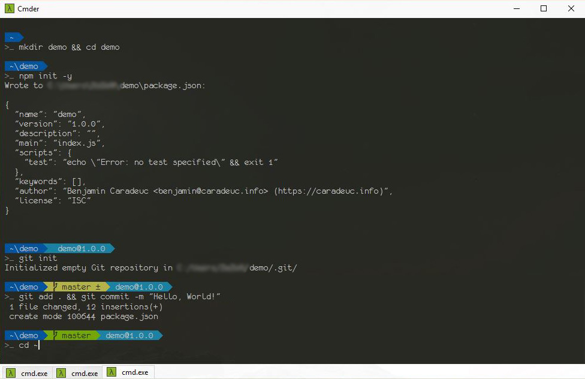

# CMDER CUSTOMISATIONS

This is a set of things I found on the web and that I modified to fit my needs.

| file | description |
|------|-------------|
| theme.lua | theme inspired from the animater theme and personalized by me. the bigger part comes from [cmder-powerline-prompt](https://github.com/AmrEldib/cmder-powerline-prompt). |
|tilde.lua| just use the `~`, and it will be replaced with your home directory path when <kbd>TAB</kbd> is pressed |

## Screenshot

I use `monofur for powerline` font from [powerline fonts](https://github.com/powerline/fonts)

## HowTo

* copy & paste the .lua files in %cmder_root%/config
* restart cmder

## Tips

Add to vscode: https://github.com/microsoft/vscode/issues/12006#issuecomment-315539390
